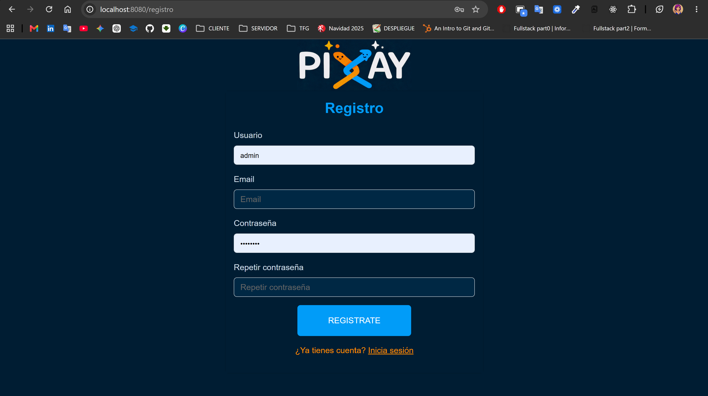
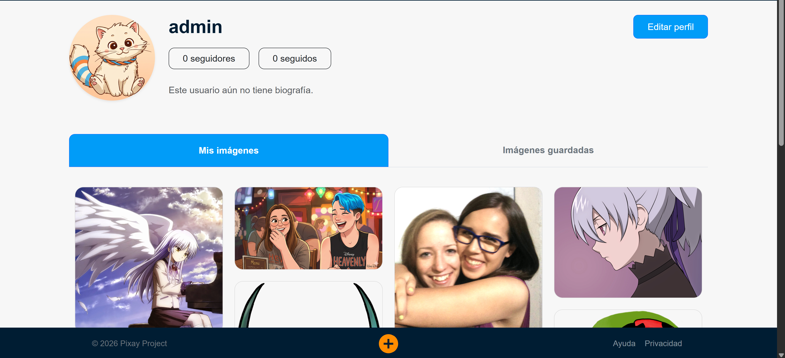

# MEMORIA DEL PROYECTO INTERMODULAR: PIXAY

**Título del proyecto:** Pixay  
**Autores:** Daniel Salgado, Doris Naomi Mansaray y Cristina Ouellette  
**Año académico:** 2025-2026  
**Ciclo:** CFGS Desarrollo de Aplicaciones Web (DAW)  
**Centro:** I.E.S. Alonso de Avellaneda

---

## 1. Introducción y justificación

### Breve descripción
Pixay es una plataforma web diseñada específicamente para la comunidad artística. El objetivo principal es crear un ecosistema dinámico donde artistas de diversas disciplinas (dibujo digital, fotografía, ilustración, etc.) puedan compartir su portfolio, interactuar con otros creadores y encontrar inspiración. La aplicación actúa como un punto de encuentro que combina las capacidades de un banco de imágenes con funciones de red social.

### Motivación
La elección de este proyecto nace de la necesidad de ofrecer un espacio dedicado exclusivamente al arte visual que permita una navegación fluida y una interacción directa. A diferencia de los bancos de imágenes genéricos, Pixay busca fomentar la colaboración y el feedback mediante herramientas sociales integradas como el chat por publicación y el sistema de seguimiento entre artistas.

---

## 2. Análisis y diseño del proyecto

### 2.1. Descripción de la arquitectura web
La aplicación sigue una **Arquitectura Desacoplada** (Frontend y Backend separados) basada en dos módulos:
*   **Backend (PixayAPI):** Una API RESTful encargada de la lógica de negocio, persistencia de datos en H2 y seguridad mediante JWT.
*   **Frontend (PixayMVC):** Una aplicación basada en el patrón Modelo-Vista-Controlador (MPA) que consume la API mediante WebClient y renderiza vistas dinámicas con Thymeleaf.

### 2.2. Tecnologías y herramientas utilizadas
*   **Frontend:** HTML5, CSS3, JavaScript (ES6+), Bootstrap 5, Masonry.js (layout dinámico), Thymeleaf (Fragments).
*   **Backend:** Java 25, Spring Boot 3.x, Spring Security (JWT), Spring Data JPA.
*   **Base de datos:** H2 Database (Persistencia en archivo local `.mv.db`).
*   **Comunicación:** Spring WebFlux (WebClient), Socket.io (Chat en tiempo real).
*   **Herramientas:** Git/GitHub, Miro (Planificación), IntelliJ IDEA.

### 2.3. Análisis de usuarios (Perfiles)
1.  **Visitante (Anónimo):** Puede explorar la galería global, usar el buscador y ver perfiles públicos.
2.  **Artista Registrado:** Acceso a subida de obras, edición de perfil, seguimiento de usuarios, guardado de favoritos y participación en chats.
3.  **Administrador:** Gestión y moderación global de la plataforma.

### 2.4. Definición de requisitos
*   **Requisitos Funcionales:**
    *   Sistema de registro y login seguro.
    *   Carga y filtrado de imágenes por categorías/subcategorías.
    *   Scroll infinito optimizado con lógica de `Slice`.
    *   Interacción social (Seguir/Dejar de seguir) y contadores dinámicos.
    *   Chat en tiempo real por cada obra publicada.
*   **Requisitos No Funcionales:**
    *   **Seguridad:** Uso de variables de entorno (.env) y tokens JWT expirables.
    *   **Rendimiento:** Carga diferida (*lazy loading*) y diseño responsive.
    *   **Escalabilidad:** Estructura modular preparada para migrar a bases de datos externas.

### 2.5. Estructura de navegación
*   `/` : Home (Galería global).
*   `/login` / `/registro` : Gestión de acceso.

*   `/busqueda` : Filtrado avanzado.

*   `/mi-perfil/mis-imagenes` : Gestión de portfolio personal.
*   `/mi-perfil/guardadas` : Gestión de imágenes guardadas del usuario actual.

*   `/mi-perfil/editar-perfil` : Publicación de contenido.

*   `/usuario/{id}` : Perfil público de terceros.
*   `/usuario/{id}/guardadas` : Gestión de imágenes guardadas de terceros.

*   `/imagen/{id}` : Visualización de obra y chat.

*   `/subir-imagen` : Publicación de contenido.

*   `/ajustes` : Ajustes del perfil.

### 2.6. Organización de la lógica de negocio
El proyecto se organiza en capas de responsabilidad:
1.  **Capa de Presentación (MVC):** Gestiona la sesión del usuario y el renderizado.
2.  **Capa de Servicio:** Puente de comunicación que transforma los datos de la API en DTOs consumibles por la vista.
3.  **Capa de Datos (API):** Controla el acceso a la base de datos y la integridad referencial.

### 2.7. Modelo de datos simplificado
*   **USERS / ROLES:** Gestión de identidad y permisos.
*   **CATEGORIES / SUBCATEGORIES:** Estructura jerárquica de clasificación.
*   **USERS_IMAGES:** Entidad central (Título, binario de imagen, autor y categoría).
*   **SAVED_IMAGES:** Tabla de relación para favoritos.
*   **USER_FOLLOWS:** Relación de muchos a muchos para el sistema social.

---

## 3. Conclusiones
El proyecto ha cumplido los objetivos pedagógicos y técnicos, logrando una plataforma funcional y escalable. Se han superado retos críticos como la integración de seguridad JWT entre servidores y la optimización visual de galerías asíncronas mediante Masonry.

---

## 4. Bibliografía y fuentes de información
*   Spring Boot Docs: https://spring.io/projects/spring-boot
*   Bootstrap 5: https://getbootstrap.com/
*   Masonry Layout: https://masonry.desandro.com/
*   Repositorio: https://github.com/Freyja96/Pixay
*   Miro: https://miro.com/app/board/uXjVGDTIiQk=/

---

## 5. Anexos: Guía de Instalación y Despliegue

### Requisitos previos
*   Java JDK 25 o superior.
*   Maven 3.x.

### Configuración
1.  Clonar repositorio: `git clone https://github.com/Freyja96/Pixay.git`
2.  Crear archivo `.env` en las raíces de `PixayAPI` y `PixayMVC`.
3.  Añadir variable: `JWT_SECRET=TuClaveBase64` y `JWT_EXPIRATION=24`.

### Ejecución
1.  **API (Puerto 8081):** `cd PixayAPI && mvn spring-boot:run`
2.  **MVC (Puerto 8080):** `cd PixayMVC && mvn spring-boot:run`
3.  Acceso: `http://localhost:8080`